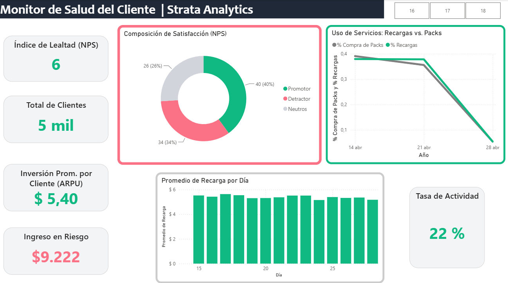

# 🚀 Cloud Data Pipeline & Analytics: Optimización de KPIs en Telecomunicaciones

Un proyecto integral de Data Engineering orientado a transformar datos crudos en *insights* de negocio accionables, utilizando una arquitectura serverless en Amazon Web Services (AWS). 

> 📎 **Documentación detallada:** [Ver Informe Técnico (PDF) aquí](docs/Informe%20de%20Proyecto.pdf)
> 
> 📊 **Dashboard Interactivo:** [Ver archivo de Power BI (.pbix) aquí](docs/Dashboard_AnaNieva.pbix)

---

## 💡 El Desafío Comercial
La empresa ficticia Strata Analytics requería entender en profundidad el comportamiento de sus clientes para mejorar sus campañas de marketing y medir la lealtad hacia la marca.

El reto consistió en procesar cuatro orígenes de datos dispares (maestro de clientes, historial de recargas, compra de paquetes y respuestas de encuestas) para calcular métricas clave de consumo y satisfacción.

## ⚙️ Arquitectura e Implementación Técnica
Se diseñó un flujo de trabajo automatizado aplicando prácticas de DataOps, centralizando todo el ecosistema en la nube de AWS.

*   **Ingesta y Almacenamiento (Amazon S3):** Implementación de un Data Lake con zonas separadas para el aterrizaje de archivos `.csv` y el almacenamiento de datos curados. Se utilizó el formato columnar **Parquet** para optimizar los costos y tiempos de consulta analítica.
*   **Transformación de Datos (AWS Glue & Lambda):** 
    *   Desarrollo de procesos ETL combinando el entorno visual de Glue Studio con scripts nativos en **SQL** y **PySpark**.
    *   Limpieza exhaustiva: tratamiento de valores nulos y de duplicación de registros usando la clave `accs_mthd_cd`.
    *   Cruces complejos mediante `CROSS JOIN` para consolidar métricas semanales contra el total de la base de usuarios.

## 📈 Insights y Visualización (Power BI)
La capa de visualización se construyó conectando el dashboard ("Monitor de Salud del Cliente") directamente a los datos procesados, revelando el siguiente escenario de negocio:

*   **Métricas de Monetización:** Se identificó una Inversión Promedio por Cliente (ARPU) de **$5,40** y se calculó un **Ingreso en Riesgo de $9.222**, una métrica vital para dimensionar el impacto de los clientes detractores.
*   **Salud de la Marca (NPS):** El índice de lealtad resultó en un **NPS de 6**, lo que indica una cartera altamente vulnerable (34% de detractores frente a un 40% de promotores).
*   **Comportamiento de Uso:** La tasa de actividad general es del **22%**, con una marcada caída en la interacción (tanto en recargas como en compra de packs) hacia finales del mes de abril, lo que sugiere la necesidad de intervenciones de marketing tempranas.

## 🛠️ Stack Tecnológico
*   **Ingeniería de Datos:** AWS S3, AWS Glue, AWS Lambda.
*   **Lenguajes:** SQL, PySpark, Python.
*   **Herramientas Analíticas:** Power BI, Microsoft Excel

---
*Proyecto desarrollado colaborativamente en el marco de la asignatura Taller I (Ing. en Inteligencia Artificial, UNSTA). Equipo: Castillo P., Nieva A., Pachado F., Rebora J.[cite: 1]*
*   **Cloud Data Engineering:** AWS (S3, Glue, Lambda)[cite: 1]
*   **Procesamiento:** PySpark, SQL, Formato Parquet[cite: 1]
*   **Visualización:** Power BI
